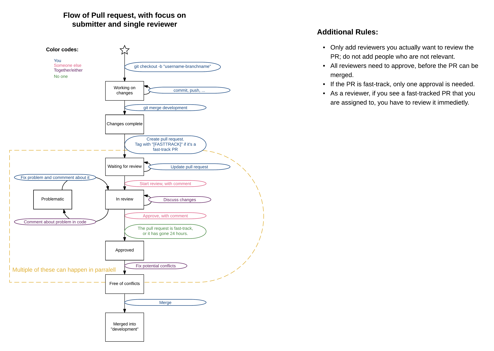

Welcome to Synq.fm's R&D team, This is your one stop shop for getting to know our system, tools, processes and technology better.

*NOTE : This workspace is always changing to reflect our latest practices and technologies*

### Development Philosphy

We use a weekly delivery model here, organized by monthly milestones (more detail below).  The idea here is, we have a milestone with some key high level points, then break it down to digestable weekly deliverables, and then push code to production every week.

### Simple Repo Rules

* Branch names should include first name of user
* Create a branch for each issue, and make it as "atomic" as possible.  Don't combine multiple features into a single branch
* Maintain no more than 1-2 active branches
* Always deploy from/branch from master

### PR Information

* PRs are posted to General
* PR requests should not be open longer than a day.
* PR request reviews should focus on
 * Having Tests
 * Contain atomic changes
 * Code organized properly
 * References the issue this PR pertains to
 * Tests passed (is enforced)
 * Approved by a reviewer (is enforced)
* PR should be "Squash and Merged" and the branch deleted.  All commit history can be found in the PR for historical purposes ( [PR 6](https://github.com/SYNQfm/obaku/pull/6) )

### Values

 * __Fail (or Succeed) Fast__ - we can't be afraid to try new technologies, techniques, and if it doesn't work, we fix it fast and learn from it.  Failures are learning oppurtunities and leads to success
 * __No Blame__ - as part of failing fast, we don't point fingers, we solve problems, this ensures we have a culture of executing without fear
 * __Collaborate__ - there are no silos, within our teams and with other departments, the only way we win is to work together for the betterment of our customers
 * __Continuous Improvement__ - we have to always be getting better, technology moves extremely fast, and a powerful tool today, maybe obselete in a short period of time.  But it doesn't have to just be big things, refactoring code, cleaning up lint errors all is part of continuous imporvement
 * __Care about your craft__ - see a bug that needs fixing, see a broken test, a process that needs improving?  Then fix it, care that what you do is done right, and even though it won't be perfect the first time (which it should almost never be), you care about making it better
 * __Be Consistent__ - follow conventions, standards, style guides are all good things, as it makes it easier to collaborate with teammates and allows us to execute faster as we follow well known systems and frameworks
 * __Have Fun__ - work shouldn't be "work", it should be fun, you should want to come in and do great work.  You also are not too serious about yourself or your code, and you enjoy having a good time with your colleagues.  If this ever becomes a job, we're in a serious trouble

### Resources

[Main Repo](https://github.com/SYNQfm/obaku)

[Wiki](https://github.com/SYNQfm/obaku/wiki)
